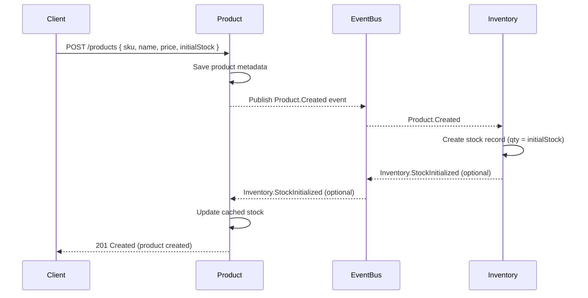

```mermaid
sequenceDiagram
    participant Client
    participant Product
    participant EventBus
    participant Inventory


    Client->>Product: POST /products { sku, name, price, initialStock }
    Product->>Product: Save product metadata
    Product-->>EventBus: Publish Product.Created event

    EventBus-->>Inventory: Product.Created
    Inventory->>Inventory: Create stock record (qty = initialStock)

    Inventory-->>EventBus: Inventory.StockInitialized (optional)
    EventBus-->>Product: Inventory.StockInitialized (optional)
    Product->>Product: Update cached stock

    Product-->>Client: 201 Created (product created)

```
