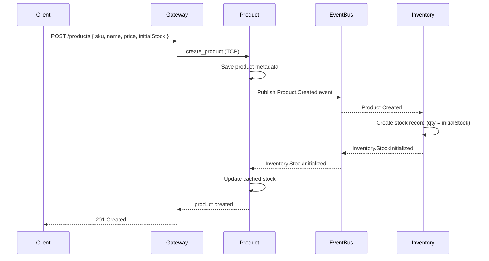
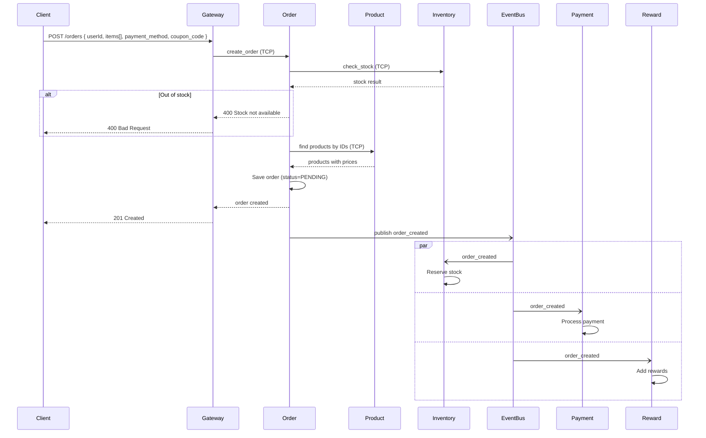

## Create Product

```mermaid
sequenceDiagram
    participant Client
    participant Gateway
    participant Product
    participant EventBus
    participant Inventory

    Client->>Gateway: POST /products { sku, name, price, initialStock }
    Gateway->>Product: create_product (TCP)
    Product->>Product: Save product metadata
    Product-->>EventBus: Publish Product.Created event

    EventBus-->>Inventory: Product.Created
    Inventory->>Inventory: Create stock record (qty = initialStock)

    Inventory-->>EventBus: Inventory.StockInitialized 
    EventBus-->>Product: Inventory.StockInitialized 
    Product->>Product: Update cached stock

    Product-->>Gateway: product created
    Gateway-->>Client: 201 Created

```

## Place Order

```mermaid
sequenceDiagram
    participant Client
    participant Gateway
    participant Order
    participant Product
    participant Inventory
    participant EventBus
    participant Payment
    participant Reward

    Client->>Gateway: POST /orders { userId, items[], payment_method, coupon_code }
    Gateway->>Order: create_order (TCP)

    Order->>Inventory: check_stock (TCP)
    Inventory-->>Order: stock result

    alt Out of stock
        Order-->>Gateway: 400 Stock not available
        Gateway-->>Client: 400 Bad Request
    end

    Order->>Product: find products by IDs (TCP)
    Product-->>Order: products with prices

    Order->>Order: Save order (status=PENDING)

    Order-->>Gateway: order created
    Gateway-->>Client: 201 Created

    Order-)EventBus: publish order_created

    par
        EventBus-)Inventory: order_created
        Inventory->>Inventory: Reserve stock
    and
        EventBus-)Payment: order_created
        Payment->>Payment: Process payment
    and
        EventBus-)Reward: order_created
        Reward->>Reward: Add rewards
    end
```
